# 3D i desktop GIS

Vi skal lage en 3D visualisering av terrengmodell i desktop GIS. Det finnes en rekke avanserte GIS platforme til desktop. Tidligere har ESRI dominert markedet med [ArcGIS](http://www.esri.com/software/arcgis) - [MapInfo](http://www.mapinfo.com/) er også stor. Etterhvert har Open Source alternativene vokst seg store - blant de mest populære er [Quantum GIS / QGIS](http://www.qgis.org/en) og [GRASS GIS](http://grass.osgeo.org/).

Du kan hente [filene til denne veiledning på github](https://github.com/GeoForum/veiledning03) - eller du kan bygge strukturen opp selv.

## QGIS og data
Gå til http://www.qgis.org/en/site/forusers/download.html, last ned og installer QGIS. Det finnes til både Linux, Mac og Windows.

Last ned terrengmodell i fra Kartverket her:
http://data.kartverket.no/download/content/digital-terrengmodell-10-m-utm-33

For å laste ned fra Kartverket, må du først [opprette ny bruker](http://data.kartverket.no/download/user/register) og logge inn. Velg de områder du ønsker terrengmodell for og klikk på "Legg i kurv > Se kurven > Bestill > laste ned filene her > Download" og du kan nå lagre data som DEM fil (xyz text koordinater), ligger her som [qgis/data/6900_2_10m_z33.dem](qgis/data/6900_2_10m_z33.dem).

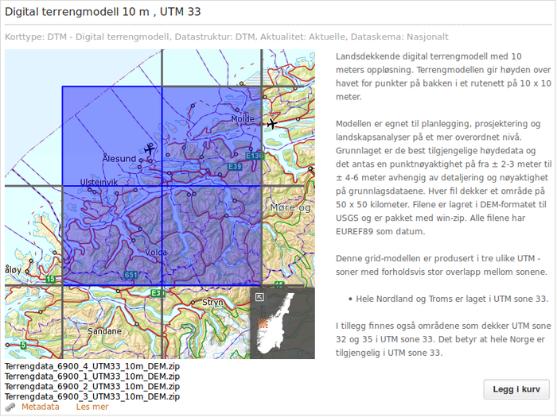

Pakk ut zip-filen og legg den til i QGIS som "raster layer". Du vil se, at QGIS ofte selv oppdager projeksjon og koordinater - i dette tilfelle EPSG:32633 - se bilde nedenfor. Hvis du ønsker kan du bruke prosjekt-filen [qgis/veiledning03a.qgs](qgis/veiledning03a.qgs) og åpne den med QGIS.

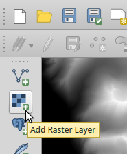 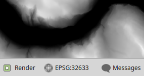

Data ligger nå i rå tekst-format som i filen [qgis/data/6900_2_10m_z33.dem](qgis/data/6900_2_10m_z33.dem). For bedre performance, er det lurt å konvertere til en binært format som fx geotiff:

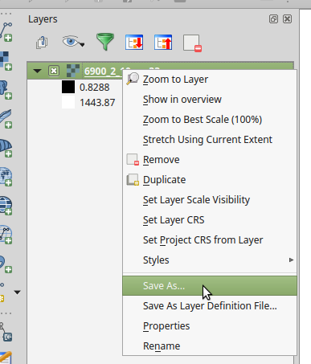 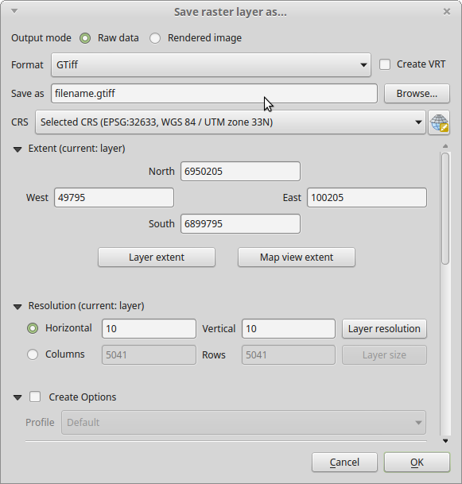

## Raster data

Terrrengmodellen her er raster data i motesettning til de forrige veiledninger, hvor vi jobbet med vektor data. Raster data er som et vanlig bilde - det består av rasters / pixels som kan have en eller flere verdier. I dette tilfelle er det en verdi for hver x-y-koordinat - nemlig en z-verdi (høyde). I et vanlig foto, er det tre verdier for hver koordinat - nemlig en verdi for rød, en for grønn og en for blå. Raster data kan inneholde hvor mange verdier som helst for hver koordinat - sattelit-bilder inneholder ofte opp til 20 verdier - også kallet "band".

## Rendering

I utgangspunktet vil QGIS vise terrengmodellen i gråfarger, men det finnes naturligvis andre kule måter å vise det på. Hvis du høyreklikker på laget og velger "duplicate" vil du få fler lag som viser til samme datakilde. Det er en grei måte å teste forskjellige måter å vise samme data på - altså forskjellige typer af kartografi - også kallet "style" eller "symbology". Kartografi lagres ikke i datakilden. Utgangspunket er greyscale:

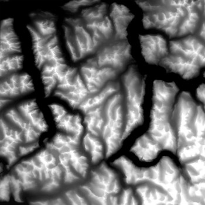 

## Pseudocolor
En måte grei kartografisk metode til dette formålet er "pseudocolor". 

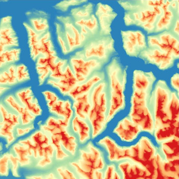 

I det andre eksemple ovenfor er valgt en fargeskala fra grønt til brun fordelt på 16 intervaller fra 1-1600 meter over havet - i tillegg er en klasse lagt til manuellt med blå-farge for havet. Brukersnittet få frem ved å høyreklikke på laget og velge "properties" og "style":

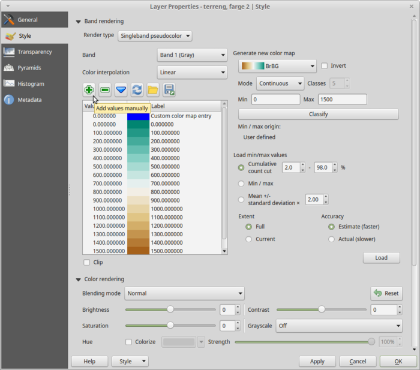

## Hillshade
En annen kul måte å vise terreng på er vha hillshade. 

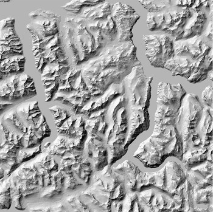 

Velg fra QGIS menyen "Raster > Analysis > DEM" og bruk Mode = Hillshade. Det lages en analyse av terrengmodellen med utgangspunkt i lysets retning (azimuth og altiude) mv og output er en ny geotiff fil med data for skygge. 

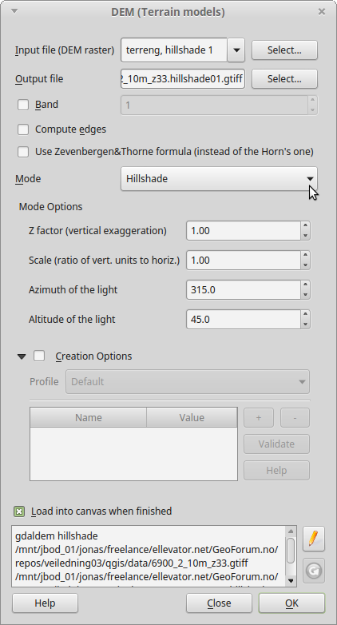 

Det ser litt rart ut vannet er farget gråt - bruk info-tool til å inspisere bildet til å bestemme hviklen verdi haveoverflaten har. Sett deretter no-data value til den verdien - prøv evt samtidig å sette global transparancy til 50%:

 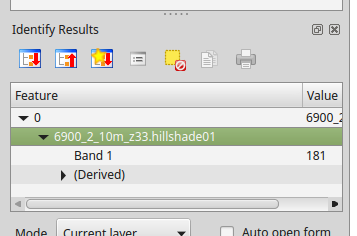


I stedet for global transparancy kan du prøve med forskjellige typer "color rendering":

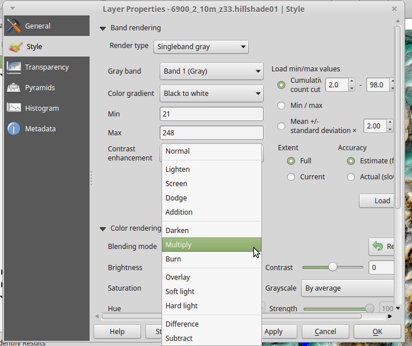

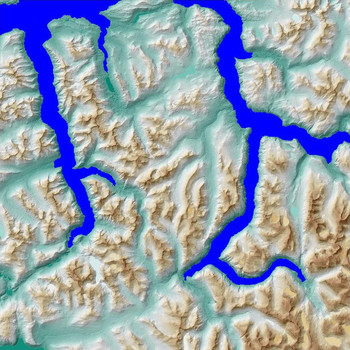 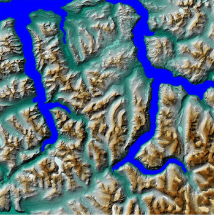 

## Slope og Aspect
Det er også mulig å analysere helningen (slope) og retning (aspect) i terregnet og vise det på kartet:

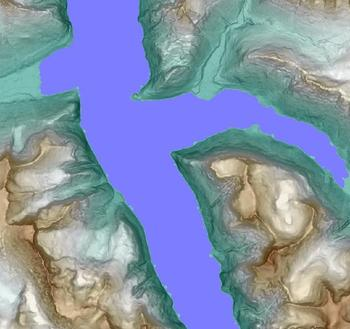 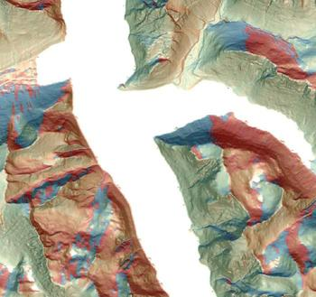

Det gjøres også under "Raster > Analysis > DEM" men med bruk av annen mode:

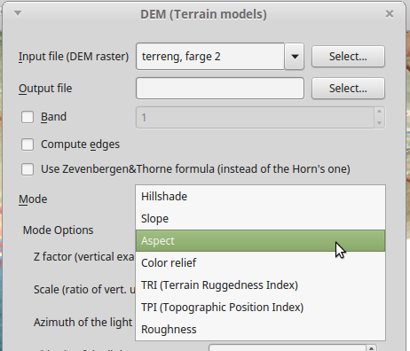 

## Raster beregning

Når man har forskjellige raster lag er det mulig å lage beregninger med dise ved å bruke verktøyet "Raster > Ŗaster Calculator":

 

I dette eksemplet finnes områder på kartet som har en retning mellem 180 og 270 grader (mellom syd og vest) og som har en helning mellom 30 og 45 grader:

```sql
"terreng, aspect 1, color@1" < 270  
AND "terreng, aspect 1, color@1" > 180 
AND "terreng, slope 1m, gray@1"  > 30 
AND  "terreng, slope 1m, gray@1"  <  45
```
Resultat ser slik ut:

 

